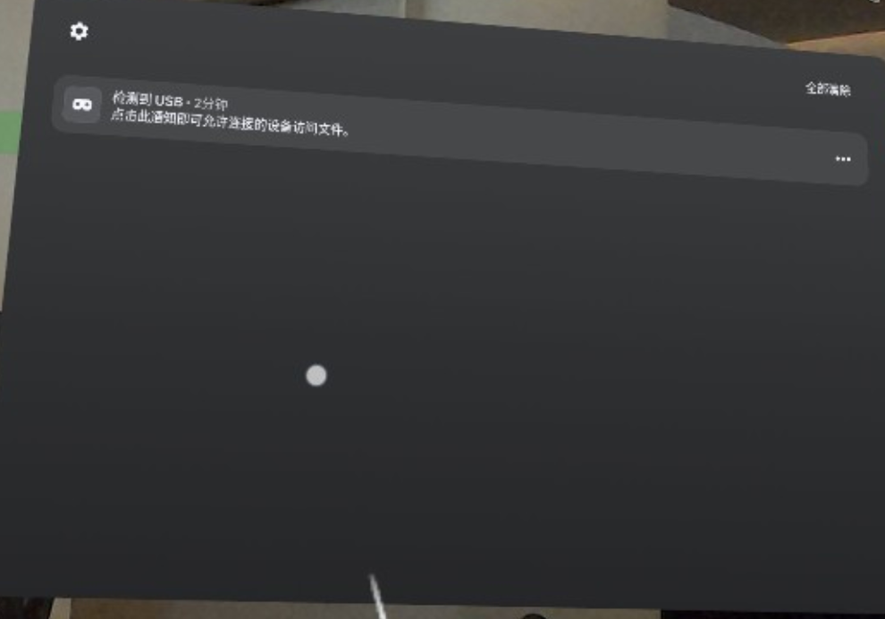
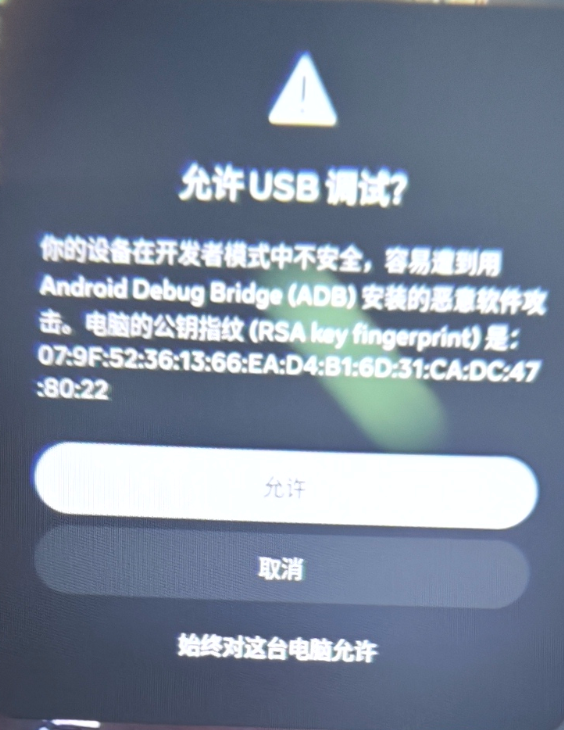
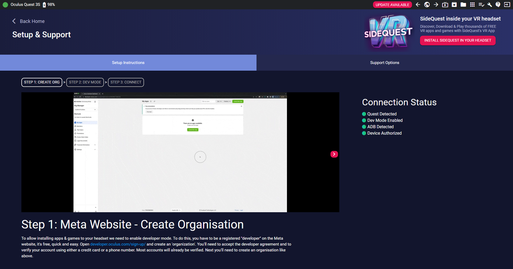
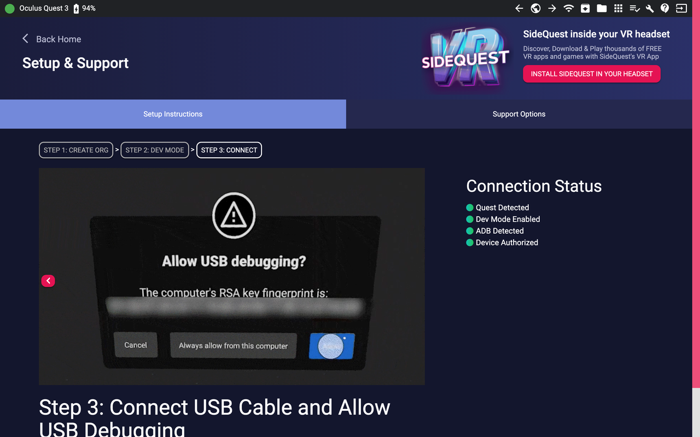

# Meta Quest 3 VR Teleoperation
通过软件实现对于VR设备的激活、下载APP和传输文件
根据自己的电脑系统选择下面的APP

## Outline
- [1. Meta SideQuest Softare Installation](#meta-sidequest-software-installation)
  - [1.1 Windows](#windows)
  - [1.2 Mac](#mac)
- [2. install apk in VR](#install-apk-in-vr)
- [3. SideQuest](#sidequest)
  - [3.1 Sign in/up](#sign-inup)
  - [3.2 connect to VR](#connect-to-vr)
  - [3.3 Upload APK file to VR](#upload-apk-file-to-vr)
- [4. VR](#vr)
- [5. ADB installation](#adb-installation)
  - [5.1 check linux version](#check-linux-version)
  - [5.2 check adb version](#check-adb-version)
  - [5.3 install adb](#install-adb)
  - [5.3.1 通过包管理器安装（推荐新手）](#adb-install-by-package-manager)
- [6. get vr info](#get-vr-info)
- [7. teleoperation](#teleoperation)

<a id="meta-sidequest-software-installation"></a>
## 1. Meta SideQuest Softare Installation
根据实际电脑系统选择对应的软件安装
<a id="windows"></a>
### 1.1 Windows
software can find in `release/SideQuest-Setup-0.10.39-x64-win.exe`
<a id="mac"></a>
### 1.2 Mac
software can find in `release/SideQuest-0.10.42.dmg`

<a id="install-apk-in-vr"></a>
## 2. install apk in VR
software can find in `release/app1_16_vis_quest_xyz_final_version.apk`

<a id="sidequest"></a>
## 3. SideQuest
安装后打开界面，点击左下角注册登录


<a id="sign-inup"></a>
### 3.1 Sign in/up
先注册登录


https://developer.oculus.com/sign-up/

选择Sign up，输入账号密码
这里因为要进入开发者模式，所以会有双重验证，选择手机号验证

<a id="connect-to-vr"></a>
### 3.2 connect to VR

用type-c线连接VR和PC，然后左上角可以显示连接设备型号，右边显示连接状态
一定要连接到PC的数据口，如果没有出现左下角的设备识别图标，则说明数据线或者端口不对

<table>
  <tr>
    <td align="center" width="33.3%">
      
    </td>
    <td align="center" width="33.3%">
      
    </td>
    <td align="center" width="33.3%">
      
    </td>
  </tr>
</table>

之后sidequest会显示设备连接状态, 见`3.1`和`3.2`

<table>
  <tr>
    <td align="center" width="50%">
      <strong>3.2.1 quest 3s</strong>
    </td>
    <td align="center" width="50%">
      <strong>3.2.2 quest 3</strong>
    </td>
  </tr>
  <tr>
    <td align="center">
      
    </td>
    <td align="center">
      
    </td>
  </tr>
</table>

<a id="upload-apk-file-to-vr"></a>
### 3.3 Upload APK file to VR 


红色箭头位置点击选择`APK`文件(path: `APP/app1_16_vis_quest_xyz_final_version.apk`)上传给VR设备，上传完成后会在左下角显示`ALL tasks completed`

<a id="vr"></a>
## 4. VR
VR打开后在右下角菜单栏里点击未知来源里查看安装的APK

<a id="adb-installation"></a>
## 5. ADB installation
### reference
https://geek-blogs.com/blog/installing-adb-on-linux/

<a id="check-linux-version"></a>
### 5.1 check linux version
ADB 的安装方式因 Linux 发行版而异。请先确认你的系统版本（如 Ubuntu、Fedora、Arch 等），可通过以下命令查看：
```
cat /etc/os-release
```
output
```
PRETTY_NAME="Ubuntu 22.04.5 LTS"
NAME="Ubuntu"
VERSION_ID="22.04"
VERSION="22.04.5 LTS (Jammy Jellyfish)"
VERSION_CODENAME=jammy
ID=ubuntu
ID_LIKE=debian
HOME_URL="https://www.ubuntu.com/"
SUPPORT_URL="https://help.ubuntu.com/"
BUG_REPORT_URL="https://bugs.launchpad.net/ubuntu/"
PRIVACY_POLICY_URL="https://www.ubuntu.com/legal/terms-and-policies/privacy-policy"
UBUNTU_CODENAME=jammy
```

<a id="check-adb-version"></a>
### 5.2 check adb version
```
adb --version
```
output
```
command not found: adb
```
出现这个输出，则说明需要安装`adb`
```
Android Debug Bridge version 1.0.41
Version 28.0.2-debian
Installed as /usr/lib/android-sdk/platform-tools/adb
```
若输出类似 `Android Debug Bridge version 1.0.41` 的信息，则说明已安装，可跳过安装步骤直接进入 配置环节。

<a id="install-adb"></a>
### 5.3 install adb
<a id="adb-install-by-package-manager"></a>
#### 5.3.1 通过包管理器安装（推荐新手）
Linux 主流发行版的官方软件仓库中通常包含 ADB 工具（包名多为 `android-tools` 或 `android-tools-adb`），通过包管理器安装可自动处理依赖和环境变量，适合新手。

##### 5.3.1.1 Debian/Ubuntu 及衍生系统
```
# 更新软件源
sudo apt update
# 安装 ADB（包含 adb 和 fastboot）
sudo apt install android-tools-adb android-tools-fastboot
```
<details>
<summary>output></summary>
获取:1 http://mirrors.tuna.tsinghua.edu.cn/ros/ubuntu focal InRelease [4,679 B]
命中:2 http://mirrors.ustc.edu.cn/ubuntu focal InRelease                       
命中:3 http://mirrors.tuna.tsinghua.edu.cn/ros2/ubuntu focal InRelease         
获取:4 http://mirrors.ustc.edu.cn/ubuntu focal-updates InRelease [128 kB]  
获取:5 http://mirrors.ustc.edu.cn/ubuntu focal-backports InRelease [128 kB]    
获取:6 http://mirrors.ustc.edu.cn/ubuntu focal-security InRelease [128 kB]     
获取:7 http://mirrors.ustc.edu.cn/ubuntu focal-updates/main i386 Packages [1,114 kB]
获取:8 http://mirrors.ustc.edu.cn/ubuntu focal-updates/main amd64 Packages [3,957 kB]
获取:9 http://mirrors.ustc.edu.cn/ubuntu focal-updates/main amd64 DEP-11 Metadata [276 kB]
获取:10 http://mirrors.ustc.edu.cn/ubuntu focal-updates/restricted amd64 DEP-11 Metadata [212 B]
获取:11 http://mirrors.ustc.edu.cn/ubuntu focal-updates/universe amd64 DEP-11 Metadata [445 kB]
获取:12 http://mirrors.ustc.edu.cn/ubuntu focal-updates/multiverse amd64 DEP-11 Metadata [940 B]
获取:13 http://mirrors.ustc.edu.cn/ubuntu focal-backports/main amd64 DEP-11 Metadata [7,980 B]
获取:14 http://mirrors.ustc.edu.cn/ubuntu focal-backports/restricted amd64 DEP-11 Metadata [216 B]
获取:15 http://mirrors.ustc.edu.cn/ubuntu focal-backports/universe amd64 DEP-11 Metadata [30.5 kB]
获取:16 http://mirrors.ustc.edu.cn/ubuntu focal-backports/multiverse amd64 DEP-11 Metadata [212 B]
获取:17 http://mirrors.ustc.edu.cn/ubuntu focal-security/main i386 Packages [881 kB]
获取:18 http://mirrors.ustc.edu.cn/ubuntu focal-security/main amd64 Packages [3,564 kB]
获取:19 http://mirrors.ustc.edu.cn/ubuntu focal-security/main amd64 DEP-11 Metadata [74.6 kB]
获取:20 http://mirrors.ustc.edu.cn/ubuntu focal-security/restricted amd64 DEP-11 Metadata [212 B]
获取:21 http://mirrors.ustc.edu.cn/ubuntu focal-security/universe amd64 DEP-11 Metadata [160 kB]
获取:22 http://mirrors.ustc.edu.cn/ubuntu focal-security/multiverse amd64 DEP-11 Metadata [940 B]
获取:23 https://downloads.cursor.com/aptrepo stable InRelease [2,672 B]        
获取:24 https://downloads.cursor.com/aptrepo stable/main amd64 Packages [1,452 B]
获取:25 https://repo.steampowered.com/steam stable InRelease [3,622 B]
获取:26 https://downloads.cursor.com/aptrepo stable/main all Packages [571 B]
获取:27 https://downloads.cursor.com/aptrepo stable/main arm64 Packages [1,473 B]
已下载 10.9 MB，耗时 3秒 (3,205 kB/s)  
正在读取软件包列表... 完成
正在分析软件包的依赖关系树       
正在读取状态信息... 完成       
有 307 个软件包可以升级。请执行 ‘apt list --upgradable’ 来查看它们。
正在读取软件包列表... 完成
正在分析软件包的依赖关系树       
正在读取状态信息... 完成       
将会同时安装下列软件：
  adb android-libadb android-libbacktrace android-libbase android-libboringssl
  android-libcrypto-utils android-libcutils android-libetc1
  android-libf2fs-utils android-liblog android-libsparse android-libunwind
  android-libutils android-libziparchive android-sdk-platform-tools
  android-sdk-platform-tools-common dmtracedump etc1tool f2fs-tools fastboot
  hprof-conv libf2fs-format4 libf2fs5 p7zip p7zip-full sqlite3
建议安装：
  p7zip-rar sqlite3-doc
下列【新】软件包将被安装：
  adb android-libadb android-libbacktrace android-libbase android-libboringssl
  android-libcrypto-utils android-libcutils android-libetc1
  android-libf2fs-utils android-liblog android-libsparse android-libunwind
  android-libutils android-libziparchive android-sdk-platform-tools
  android-sdk-platform-tools-common android-tools-adb android-tools-fastboot
  dmtracedump etc1tool f2fs-tools fastboot hprof-conv libf2fs-format4 libf2fs5
  p7zip p7zip-full sqlite3
升级了 0 个软件包，新安装了 28 个软件包，要卸载 0 个软件包，有 307 个软件包未被升级。
需要下载 3,788 kB 的归档。
解压缩后会消耗 13.1 MB 的额外空间。
您希望继续执行吗？ [Y/n] y
获取:1 http://mirrors.ustc.edu.cn/ubuntu focal/universe amd64 android-liblog amd64 1:8.1.0+r23-5ubuntu2 [41.9 kB]
获取:2 http://mirrors.ustc.edu.cn/ubuntu focal/universe amd64 android-libbase amd64 1:8.1.0+r23-5ubuntu2 [22.4 kB]
获取:3 http://mirrors.ustc.edu.cn/ubuntu focal/universe amd64 android-libboringssl amd64 8.1.0+r23-2build1 [538 kB]
获取:4 http://mirrors.ustc.edu.cn/ubuntu focal/universe amd64 android-libcrypto-utils amd64 1:8.1.0+r23-5ubuntu2 [8,324 B]
获取:5 http://mirrors.ustc.edu.cn/ubuntu focal/universe amd64 android-libcutils amd64 1:8.1.0+r23-5ubuntu2 [22.5 kB]
获取:6 http://mirrors.ustc.edu.cn/ubuntu focal/universe amd64 android-libadb amd64 1:8.1.0+r23-5ubuntu2 [123 kB]
获取:7 http://mirrors.ustc.edu.cn/ubuntu focal/universe amd64 adb amd64 1:8.1.0+r23-5ubuntu2 [87.6 kB]
获取:8 http://mirrors.ustc.edu.cn/ubuntu focal/universe amd64 p7zip amd64 16.02+dfsg-7build1 [358 kB]
获取:9 http://mirrors.ustc.edu.cn/ubuntu focal/universe amd64 p7zip-full amd64 16.02+dfsg-7build1 [1,187 kB]
获取:10 http://mirrors.ustc.edu.cn/ubuntu focal/universe amd64 android-libunwind amd64 8.1.0+r23-2 [50.7 kB]
获取:11 http://mirrors.ustc.edu.cn/ubuntu focal/universe amd64 android-libbacktrace amd64 1:8.1.0+r23-5ubuntu2 [45.2 kB]
获取:12 http://mirrors.ustc.edu.cn/ubuntu focal/universe amd64 android-libetc1 amd64 1:8.1.0+r23-2build1 [17.7 kB]
获取:13 http://mirrors.ustc.edu.cn/ubuntu focal/universe amd64 libf2fs5 amd64 1.11.0-1.1ubuntu1 [14.1 kB]
获取:14 http://mirrors.ustc.edu.cn/ubuntu focal/universe amd64 libf2fs-format4 amd64 1.11.0-1.1ubuntu1 [16.6 kB]
获取:15 http://mirrors.ustc.edu.cn/ubuntu focal/universe amd64 android-libsparse amd64 1:8.1.0+r23-5ubuntu2 [16.0 kB]
获取:16 http://mirrors.ustc.edu.cn/ubuntu focal/universe amd64 android-libf2fs-utils amd64 8.1.0+r23-2 [11.0 kB]
获取:17 http://mirrors.ustc.edu.cn/ubuntu focal/universe amd64 android-libutils amd64 1:8.1.0+r23-5ubuntu2 [48.1 kB]
获取:18 http://mirrors.ustc.edu.cn/ubuntu focal/universe amd64 android-libziparchive amd64 1:8.1.0+r23-5ubuntu2 [23.5 kB]
获取:19 http://mirrors.ustc.edu.cn/ubuntu focal/universe amd64 android-sdk-platform-tools-common all 27.0.0+12 [6,648 B]
获取:20 http://mirrors.ustc.edu.cn/ubuntu focal/universe amd64 f2fs-tools amd64 1.11.0-1.1ubuntu1 [154 kB]
获取:21 http://mirrors.ustc.edu.cn/ubuntu focal/universe amd64 dmtracedump amd64 8.1.0+r23-3 [26.3 kB]
获取:22 http://mirrors.ustc.edu.cn/ubuntu focal/universe amd64 etc1tool amd64 8.1.0+r23-1build1 [18.5 kB]
获取:23 http://mirrors.ustc.edu.cn/ubuntu focal/universe amd64 fastboot amd64 1:8.1.0+r23-5ubuntu2 [58.5 kB]
获取:24 http://mirrors.ustc.edu.cn/ubuntu focal/universe amd64 hprof-conv amd64 8.1.0+r23-2 [13.2 kB]
获取:25 http://mirrors.ustc.edu.cn/ubuntu focal-updates/main amd64 sqlite3 amd64 3.31.1-4ubuntu0.7 [860 kB]
获取:26 http://mirrors.ustc.edu.cn/ubuntu focal/universe amd64 android-sdk-platform-tools amd64 27.0.0+12 [3,564 B]
获取:27 http://mirrors.ustc.edu.cn/ubuntu focal/universe amd64 android-tools-adb all 1:8.1.0+r23-5ubuntu2 [11.0 kB]
获取:28 http://mirrors.ustc.edu.cn/ubuntu focal/universe amd64 android-tools-fastboot all 1:8.1.0+r23-5ubuntu2 [4,060 B]
已下载 3,788 kB，耗时 3秒 (1,323 kB/s)        
正在选中未选择的软件包 android-liblog。
(正在读取数据库 ... 系统当前共安装有 318733 个文件和目录。)
准备解压 .../00-android-liblog_1%3a8.1.0+r23-5ubuntu2_amd64.deb  ...
正在解压 android-liblog (1:8.1.0+r23-5ubuntu2) ...
正在选中未选择的软件包 android-libbase。
准备解压 .../01-android-libbase_1%3a8.1.0+r23-5ubuntu2_amd64.deb  ...
正在解压 android-libbase (1:8.1.0+r23-5ubuntu2) ...
正在选中未选择的软件包 android-libboringssl。
准备解压 .../02-android-libboringssl_8.1.0+r23-2build1_amd64.deb  ...
正在解压 android-libboringssl (8.1.0+r23-2build1) ...
正在选中未选择的软件包 android-libcrypto-utils。
准备解压 .../03-android-libcrypto-utils_1%3a8.1.0+r23-5ubuntu2_amd64.deb  ...
正在解压 android-libcrypto-utils (1:8.1.0+r23-5ubuntu2) ...
正在选中未选择的软件包 android-libcutils。
准备解压 .../04-android-libcutils_1%3a8.1.0+r23-5ubuntu2_amd64.deb  ...
正在解压 android-libcutils (1:8.1.0+r23-5ubuntu2) ...
正在选中未选择的软件包 android-libadb。
准备解压 .../05-android-libadb_1%3a8.1.0+r23-5ubuntu2_amd64.deb  ...
正在解压 android-libadb (1:8.1.0+r23-5ubuntu2) ...
正在选中未选择的软件包 adb。
准备解压 .../06-adb_1%3a8.1.0+r23-5ubuntu2_amd64.deb  ...
正在解压 adb (1:8.1.0+r23-5ubuntu2) ...
正在选中未选择的软件包 p7zip。
准备解压 .../07-p7zip_16.02+dfsg-7build1_amd64.deb  ...
正在解压 p7zip (16.02+dfsg-7build1) ...
正在选中未选择的软件包 p7zip-full。
准备解压 .../08-p7zip-full_16.02+dfsg-7build1_amd64.deb  ...
正在解压 p7zip-full (16.02+dfsg-7build1) ...
正在选中未选择的软件包 android-libunwind。
准备解压 .../09-android-libunwind_8.1.0+r23-2_amd64.deb  ...
正在解压 android-libunwind (8.1.0+r23-2) ...
正在选中未选择的软件包 android-libbacktrace。
准备解压 .../10-android-libbacktrace_1%3a8.1.0+r23-5ubuntu2_amd64.deb  ...
正在解压 android-libbacktrace (1:8.1.0+r23-5ubuntu2) ...
正在选中未选择的软件包 android-libetc1。
准备解压 .../11-android-libetc1_1%3a8.1.0+r23-2build1_amd64.deb  ...
正在解压 android-libetc1 (1:8.1.0+r23-2build1) ...
正在选中未选择的软件包 libf2fs5:amd64。
准备解压 .../12-libf2fs5_1.11.0-1.1ubuntu1_amd64.deb  ...
正在解压 libf2fs5:amd64 (1.11.0-1.1ubuntu1) ...
正在选中未选择的软件包 libf2fs-format4:amd64。
准备解压 .../13-libf2fs-format4_1.11.0-1.1ubuntu1_amd64.deb  ...
正在解压 libf2fs-format4:amd64 (1.11.0-1.1ubuntu1) ...
正在选中未选择的软件包 android-libsparse。
准备解压 .../14-android-libsparse_1%3a8.1.0+r23-5ubuntu2_amd64.deb  ...
正在解压 android-libsparse (1:8.1.0+r23-5ubuntu2) ...
正在选中未选择的软件包 android-libf2fs-utils。
准备解压 .../15-android-libf2fs-utils_8.1.0+r23-2_amd64.deb  ...
正在解压 android-libf2fs-utils (8.1.0+r23-2) ...
正在选中未选择的软件包 android-libutils。
准备解压 .../16-android-libutils_1%3a8.1.0+r23-5ubuntu2_amd64.deb  ...
正在解压 android-libutils (1:8.1.0+r23-5ubuntu2) ...
正在选中未选择的软件包 android-libziparchive。
准备解压 .../17-android-libziparchive_1%3a8.1.0+r23-5ubuntu2_amd64.deb  ...
正在解压 android-libziparchive (1:8.1.0+r23-5ubuntu2) ...
正在选中未选择的软件包 android-sdk-platform-tools-common。
准备解压 .../18-android-sdk-platform-tools-common_27.0.0+12_all.deb  ...
正在解压 android-sdk-platform-tools-common (27.0.0+12) ...
正在选中未选择的软件包 f2fs-tools。
准备解压 .../19-f2fs-tools_1.11.0-1.1ubuntu1_amd64.deb  ...
正在解压 f2fs-tools (1.11.0-1.1ubuntu1) ...
正在选中未选择的软件包 dmtracedump。
准备解压 .../20-dmtracedump_8.1.0+r23-3_amd64.deb  ...
正在解压 dmtracedump (8.1.0+r23-3) ...
正在选中未选择的软件包 etc1tool。
准备解压 .../21-etc1tool_8.1.0+r23-1build1_amd64.deb  ...
正在解压 etc1tool (8.1.0+r23-1build1) ...
正在选中未选择的软件包 fastboot。
准备解压 .../22-fastboot_1%3a8.1.0+r23-5ubuntu2_amd64.deb  ...
正在解压 fastboot (1:8.1.0+r23-5ubuntu2) ...
正在选中未选择的软件包 hprof-conv。
准备解压 .../23-hprof-conv_8.1.0+r23-2_amd64.deb  ...
正在解压 hprof-conv (8.1.0+r23-2) ...
正在选中未选择的软件包 sqlite3。
准备解压 .../24-sqlite3_3.31.1-4ubuntu0.7_amd64.deb  ...
正在解压 sqlite3 (3.31.1-4ubuntu0.7) ...
正在选中未选择的软件包 android-sdk-platform-tools。
准备解压 .../25-android-sdk-platform-tools_27.0.0+12_amd64.deb  ...
正在解压 android-sdk-platform-tools (27.0.0+12) ...
正在选中未选择的软件包 android-tools-adb。
准备解压 .../26-android-tools-adb_1%3a8.1.0+r23-5ubuntu2_all.deb  ...
正在解压 android-tools-adb (1:8.1.0+r23-5ubuntu2) ...
正在选中未选择的软件包 android-tools-fastboot。
准备解压 .../27-android-tools-fastboot_1%3a8.1.0+r23-5ubuntu2_all.deb  ...
正在解压 android-tools-fastboot (1:8.1.0+r23-5ubuntu2) ...
正在设置 android-sdk-platform-tools-common (27.0.0+12) ...
正在设置 android-liblog (1:8.1.0+r23-5ubuntu2) ...
正在设置 android-libetc1 (1:8.1.0+r23-2build1) ...
正在设置 libf2fs5:amd64 (1.11.0-1.1ubuntu1) ...
正在设置 android-libboringssl (8.1.0+r23-2build1) ...
正在设置 android-libcrypto-utils (1:8.1.0+r23-5ubuntu2) ...
正在设置 dmtracedump (8.1.0+r23-3) ...
正在设置 etc1tool (8.1.0+r23-1build1) ...
正在设置 hprof-conv (8.1.0+r23-2) ...
正在设置 android-libbase (1:8.1.0+r23-5ubuntu2) ...
正在设置 libf2fs-format4:amd64 (1.11.0-1.1ubuntu1) ...
正在设置 sqlite3 (3.31.1-4ubuntu0.7) ...
正在设置 p7zip (16.02+dfsg-7build1) ...
正在设置 android-libcutils (1:8.1.0+r23-5ubuntu2) ...
正在设置 f2fs-tools (1.11.0-1.1ubuntu1) ...
正在设置 android-libadb (1:8.1.0+r23-5ubuntu2) ...
正在设置 p7zip-full (16.02+dfsg-7build1) ...
正在设置 adb (1:8.1.0+r23-5ubuntu2) ...
正在设置 android-libsparse (1:8.1.0+r23-5ubuntu2) ...
正在设置 android-libunwind (8.1.0+r23-2) ...
正在设置 android-libbacktrace (1:8.1.0+r23-5ubuntu2) ...
正在设置 android-tools-adb (1:8.1.0+r23-5ubuntu2) ...
正在设置 android-libf2fs-utils (8.1.0+r23-2) ...
正在设置 android-libutils (1:8.1.0+r23-5ubuntu2) ...
正在设置 android-libziparchive (1:8.1.0+r23-5ubuntu2) ...
正在设置 fastboot (1:8.1.0+r23-5ubuntu2) ...
正在设置 android-sdk-platform-tools (27.0.0+12) ...
正在设置 android-tools-fastboot (1:8.1.0+r23-5ubuntu2) ...
正在处理用于 libc-bin (2.31-0ubuntu9.18) 的触发器 ...
正在处理用于 man-db (2.9.1-1) 的触发器 ...
正在处理用于 initramfs-tools (0.136ubuntu6.7) 的触发器 ...
update-initramfs: Generating /boot/initrd.img-5.15.0-139-generic
</details>

##### 5.3.1.2 手动安装最新版本（推荐进阶用户）
若通过包管理器安装的 `ADB` 版本过旧（例如需要支持 `Android 14+` 的新特性），可从 `Google` 官方下载最新的 `Platform Tools` 包手动安装。

###### 5.3.1.2.1 下载 Platform Tools
访问 Google 官方 Platform Tools 下载页，选择 Linux 版本（文件名格式：`platform-tools.zip`），或通过命令行下载（以当前最新版为例）：
```
# 使用 wget 下载
sudo apt install wget
wget https://dl.google.com/android/repository/platform-tools-latest-linux.zip -O platform-tools.zip
```

###### 5.3.1.2.2 解压并配置路径
```
# 解压到用户目录（例如 ~/android-sdk）
mkdir -p ~/android-sdk
unzip platform-tools.zip -d ~/android-sdk/ 

# 将 ADB 添加到系统 PATH（临时生效，重启后失效）
export PATH=$PATH:~/android-sdk/platform-tools 
# 永久生效：将路径添加到 .bashrc 或 .zshrc（根据 shell 类型选择）

# zsh
echo 'export PATH=$PATH:~/android-sdk/platform-tools' >> ~/.zshrc# 立即生效
source ~/.zshrc

# bash
echo 'export PATH=$PATH:~/android-sdk/platform-tools' >> ~/.bashrc# 立即生效
source ~/.bashrc
```
验证路径配置：执行 `echo $PATH`，若输出包含 `~/android-sdk/platform-tools`，则配置成功。

###### 5.3.1.2.3 验证权限
手动安装的 adb 二进制文件默认具有执行权限，若提示 `"Permission denied"`，可通过以下命令修复：
```
chmod +x ~/android-sdk/platform-tools/adb
```

<a id="get-vr-info"></a>
## 6. get vr info
```
python vr/quest_pose.py
```
<a id="teleoperation"></a>
## 7. teleoperation 
```
python teleoperation/quest_xarm.py
```
